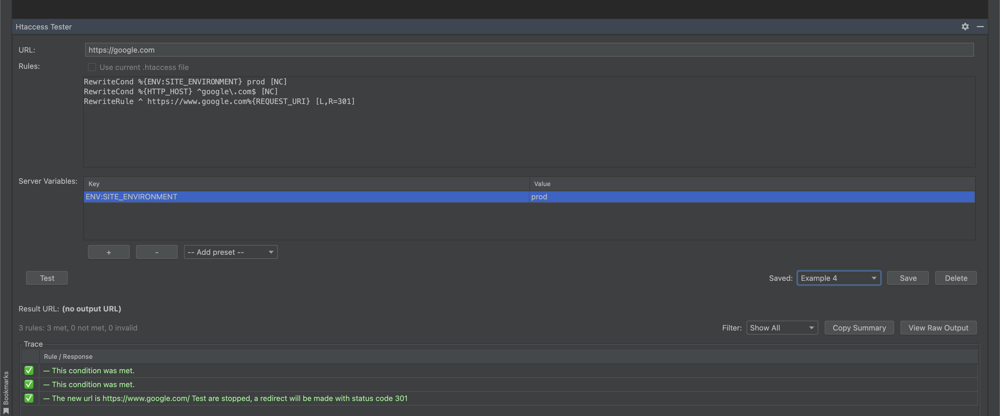

# Htaccess Tester

A JetBrains IDE plugin that tests `.htaccess` rewrite rules against a remote evaluation service.

## Scope

This plugin provides an integrated way to test Apache `.htaccess` rewrite rules directly from your IDE. It sends your rules and a test URL to the [htaccess.madewithlove.com](https://htaccess.madewithlove.com) API and displays the results, including:

- The final output URL after rewrites
- A step-by-step trace showing which rules matched
- Per-rule status (met, valid, reached)

### Features

- Test `.htaccess` rules against any URL
- Support for custom server variables
- Read rules directly from open `.htaccess` files in the editor
- Save and reload test cases per project
- Filter and analyze rule evaluation results
- Automatic retry for transient server errors

## Usage

### Opening the Tool Window

- **Via Menu**: Go to **Tools** → **Htaccess Tester** → **Open Tool Window**
- **Via Tool Window Bar**: Click the "Htaccess Tester" tab at the bottom of your IDE

### Testing Rules

1. Enter the **URL** you want to test (e.g., `https://example.com/old-page`)
2. Enter your `.htaccess` **Rules** in the text area, or check "Use current .htaccess file" to read from an open editor
3. Optionally add **Server Variables** using the table (e.g., `HTTPS=on`, `HTTP_HOST=example.com`)
4. Click **Test**

### Understanding Results

- **Result URL**: Shows the final URL after all rewrites are applied
- **Trace Table**: Shows each rule with its status:
  - ✅ Green check: Rule was met/matched
  - ❌ Red X: Rule is not matched or invalid (syntax error)
- **Filter**: Use the dropdown to show only failed, met, or reached rules
- **Copy Summary**: Copies a text summary to your clipboard

### Saving Test Cases

1. Enter your URL and rules
2. Click **Save**
3. Enter a name for your test case
4. Load saved cases from the dropdown

### Editor Integration

Right-click any `.htaccess` file in the editor and select **Test with Htaccess Tester** to automatically load its contents.

- **Internet access**: This plugin requires connectivity to the remote evaluator at `htaccess.madewithlove.com`
- **JetBrains IDE**: Compatible with IntelliJ IDEA 2024.1+, PhpStorm, WebStorm, and other JetBrains IDEs

## Privacy Notice

When you use this plugin, the following data is sent to the remote evaluation service at `htaccess.madewithlove.com`:

- The URL you want to test
- Your `.htaccess` rules
- Any custom server variables you configure

**Important considerations:**
- Do not include sensitive information (passwords, API keys, etc.) in your rules or URLs
- The service may log requests for debugging purposes
- No data is stored locally beyond your saved test cases and plugin settings

A first-run notice will be displayed before your first test to inform you about remote evaluation.

## Troubleshooting

### "Rate limit exceeded" error
The remote API has rate limits. Wait a few moments and try again.

### "Service unavailable" error
The htaccess.madewithlove.com service may be temporarily down. The plugin will automatically retry transient errors. Try again later if the issue persists.

### "Request timed out" error
Check your internet connection. The default timeout is 10 seconds.

### Rules not evaluating as expected
- Verify your rules work on [htaccess.madewithlove.com](https://htaccess.madewithlove.com) directly
- Check that server variables are set correctly
- Some Apache directives may not be supported by the evaluator

### Plugin not loading
Ensure you're using a compatible JetBrains IDE version (2024.1 or later).

## License

MIT License - see [LICENSE](LICENSE) for details.

## Acknowledgments

This plugin uses the [htaccess.madewithlove.com](https://htaccess.madewithlove.com) API for rule evaluation, provided by [madewithlove](https://madewithlove.com/).
